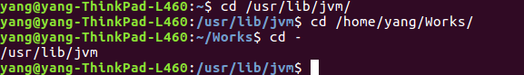
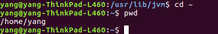

#
**Linux命令之****cd**

作者：乾坤智林	星期六, 01. 七月 2017 04:34下午
 

声明：本文主要是依据命令`man cd`整理所得，由于作者水平有限，不足之处请多指教。需要额外安装`manpages-posix-dev`。
#1.名称(name)
	简写：cd
	全名：change the working directory
	描述：改变工作目录

#2.概要(synopsis)
	cd [-L|-P]... [directory]...
	cd [选项]... [文件]...

#3.描述

|参数选项|描述|实例|
|:--|:--|:--|
|-|返回改变为当前目录的上一次所在目录|`cd -`  |
|~|改变当前目录为当前用户的home目录|`ls ~`  |
|-L,-P|有关系统的环境变量，这里不再深究|

#4.个人总结
	cd是一个非常基础，虽然简单，但又非常常用的linux系统命令，用来改变当前的工作目录，参数用的较少，常用的基本就是-，~，/，这三个选项，最后一格是去系统根目录(权限允许的前提下)。
